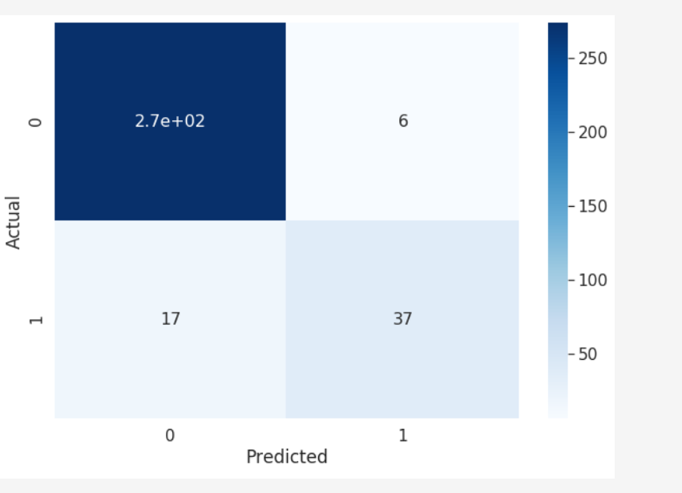

# customer_churn

**A Multi Layer perceptron model to predict customer churn in context of telecom industry ** 

   
   

  

**Context**

With the rapid development of telecommunication industry, the service providers are inclined more towards expansion of the subscriber base. To meet the need of surviving in the competitive environment, the retention of existing customers has become a huge challenge. It is stated that the cost of acquiring a new customer is far more than that for retaining the existing one. Therefore, it is imperative for the telecom industries to use advanced analytics to understand consumer behavior and in-turn predict the association of the customers as whether or not they will leave the company.

Content

This data set contains customer level information for a telecom company. Various attributes related to the services used are recorded for each customer.

**Features that have been taken to consideration to make the prediction**
-AccountWeeks
-ContractRenewal	
-DataPlan
-DataUsage
-CustServCalls
-DayMins
-DayCalls
-MonthlyCharge
-OverageFee	
-RoamMins

Confusion Matrix : 

